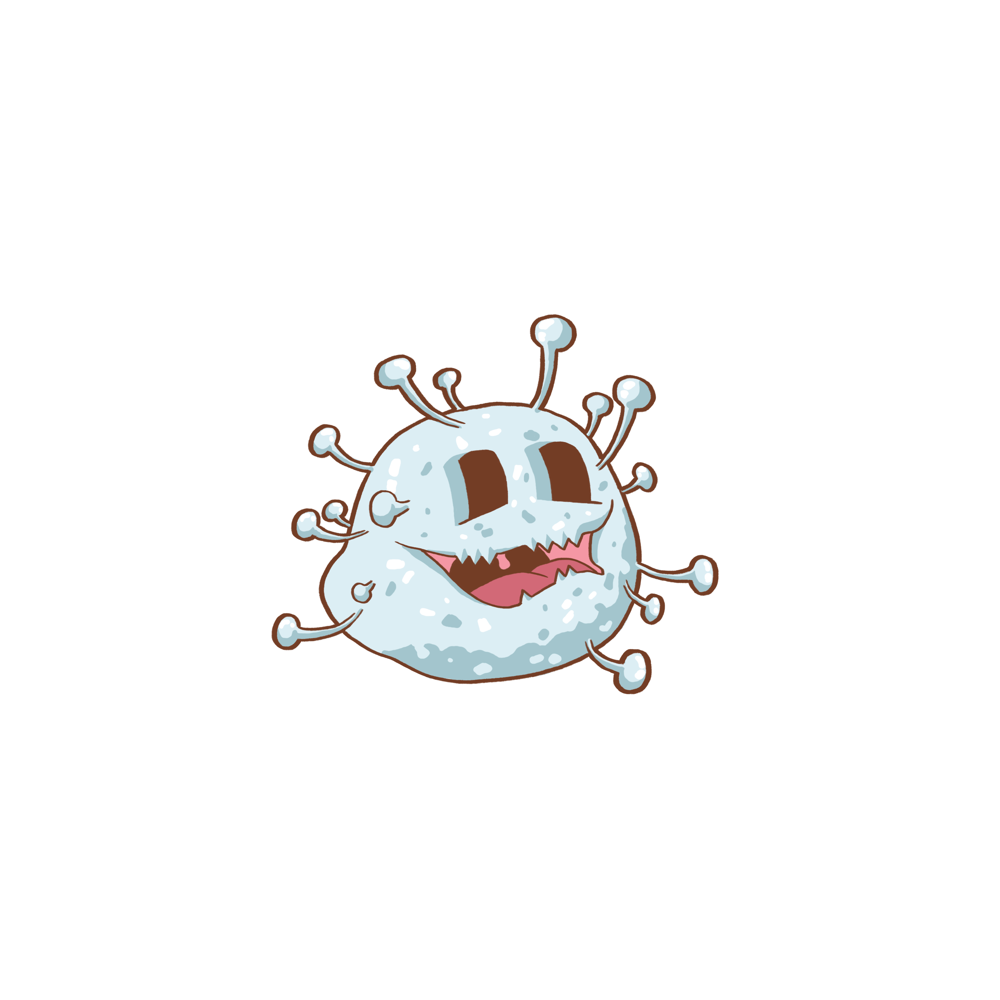

# Native JavaScript 7 Day Game Challenge | sei50-project I

## Table of contents
* [Overview](#Overview)
* [Technologies](#technologies)
* [Plan](#plan)
* [General Game Antics](#General-Game-Antics)
* [Code Examples](#code-examples)
* [Lessons Learnt](#Lessons-Learnt)
* [Challenges and Wins](#challenges-and-wins)
* [Status](#status)

## Overview

As part of the *General Assembly Software Engineering Immersive* course our initial challenge was to use native js to write a grid game with DOM manipulation.  Choosing the eighty's Pac-Man arcade game as a source of inspiration I wrote the game 'Viral Mania!'.

The game is available to play via the GitHub link [Viral Mania](https://tclark000.github.io/sei-project-1/).

## Technologies

Front End:
- JavaScript (ES5) 
- HTML 5 with HTML 5 audio
- CSS

Dev Tools:
- VScode
- ESLint
- Inspector/console logging
- Git
- GitHub

## Plan

I started by planning the [grids](Grids.numbers), one for initial play and the other that was more difficult.  The game was designed and tested with MacOS and Chrome, wide screen.  The more difficult grid is also harder to see and a increased scale would be an improvement here.

The hero character is a caricature of earth with a blinking mask:
<!---
<video style="width:70%" controls>
  <source type="video/mp4" src="heroCharacterMask.mp4">
</video>
-->


Fruit Bowl for points:  


Potion which allows the hero to attack the virus, for a limited time!:  


Hero character, game end:  


Virus Characters:


Virus character when the hero has consumed the potion (also has a yellow glow in the game):



## General Game Antics

The game has a time limit and the hero only 3 lives to play the grid.  If the hero dies they return to the starting point.  There is a pause here where I had planned to add a snippet of music but for now it is just a pause.  The game ends if:
- time runs out
- the hero lives run out
- all the fruit bowls, viruses and potions are consumed! This is a WIN!

When a potion is consumed by the hero the virus image changes (shown above), glows yellow and there is an audio clip change.

The blue virus __may__ not alway kill the hero - asymptomatic of course!

## Code Examples

The function, deleteGrid, describes how to clear the grid enabling the ability to toggle between grids:
```js  
function deleteGrid(){
    while (grid.firstChild) {
      grid.removeChild(grid.firstChild)
    }
    cells.forEach(cell => {
      cells.pop(cell)
    })
    cells.length = 0
  }
  ```

Game scoring was determined by checking the class list for 'vitamin' and also by a 'virusTally' (determined in the function virusExpire):

  ```js
  function endGame(){
    console.log('Game Ended Function')
    const vitaminTally = cells.filter(cell => {
      return (cell.classList.value).includes('vitamin')
    })
    const consumedVitamin = arrGridObject[1].position.length - vitaminTally.length
    spanSubTitle.textContent = '** Game Over | ' + consumedVitamin + ' fruit bowls and viruses vaporized: ' + virusTally + ' **'
  ```

 Different sounds were used during the game.  The initial background sound of the game (blip) that then changes when the viruses chase the hero (blop); or on consumption of a potion where the hero can chase the virus:

  ```js
  function checkForPotionAndChase(){
    if (counterPotion > 0){
      audioSrcPlay = '../sei-project-1/sounds/potionSound.wav'
    } else if (booChaseHero){
      audioSrcPlay = '../sei-project-1/sounds/Blop.wav'
    } else {
      audioSrcPlay = '../sei-project-1/sounds/Blip.wav'
    }
    window.setTimeout(checkForPotionAndChase, 100)
  }
  ```

For the virus to chase the hero the quadrant, where the hero was located, was determined and compared to previous and possible moves of the virus (part of the function moveVirus):

```js
  xH <= xV ? (xHV = 'xH < xV') : (xHV = 'xH > xV')
  yH <= yV ? (yHV = 'yH < yV') : (yHV = 'yH > yV')
  const quadrantExp = xHV + ', ' + yHV
  console.log(quadrantExp)
  let heroQuadrant = []
  switch (quadrantExp ){
    case 'xH < xV, yH < yV':
      if (Math.abs(xH - xV) > Math.abs(yH - yV)){
        heroQuadrant = ['left', 'upper']
      } else {
        heroQuadrant = ['upper', 'left']
      }
      break
    case 'xH > xV, yH < yV':
```

## Lessons Learnt

- Continual testing and console logging!
- Asynchronous coding, using delay with timers
- Emptying a grid by using array.length = 0 to null out, code in the above section
- Using a scroll lock during the game so the arrows do not move the screen
- Using callback for the checkForPotionAndChase function which changes the audio clip:
  - initial 'beep beep' when the game begins
  - potion consumed and the hero is able to kill the viruses
  - the viruses chase the hero
- Methodology in style (element/variables/execution), comments and/or descriptive function and variable names

## Challenges and Wins

- Time was the biggest challenge, it was important to ensure the base deliverables were functioning, base deliverables included scoring and the ability to win and loose
- The last features added were the ability to toggle between grids and sound, having time to add these was a win
- Determining how the virus chases the hero was a challenge (code snippet shown in [Code Examples](#code-examples))
- Important to name the functions and variables clearly for general read of the code

## Status
Project is: _currently_shelved (while focusing on other projects!)


