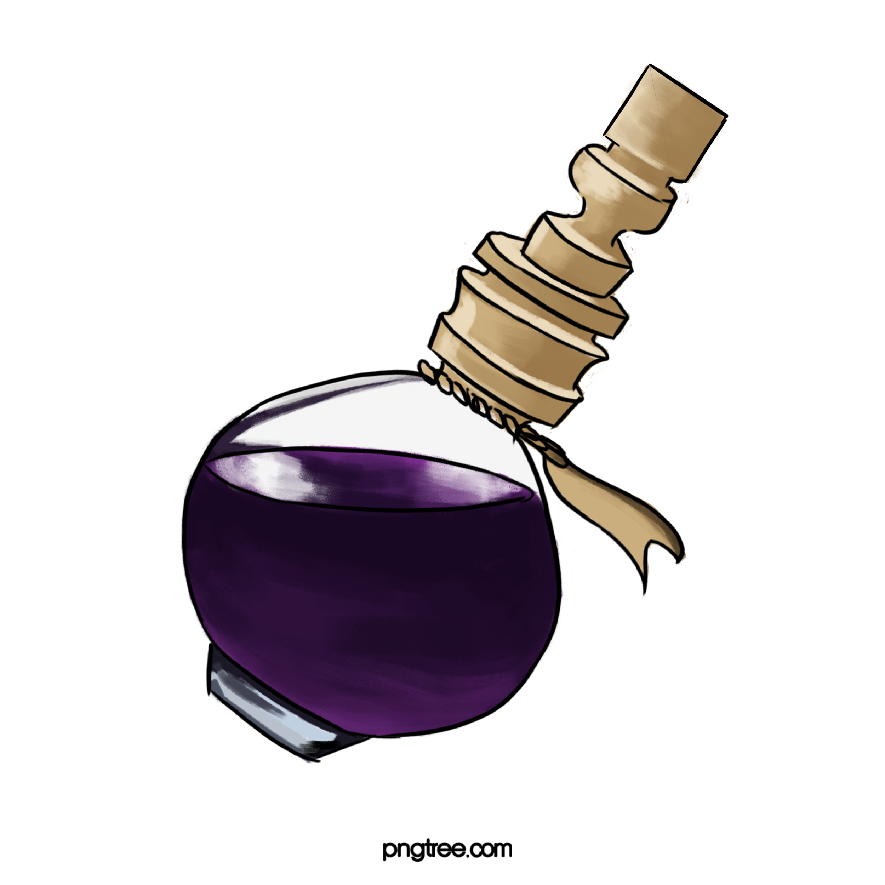
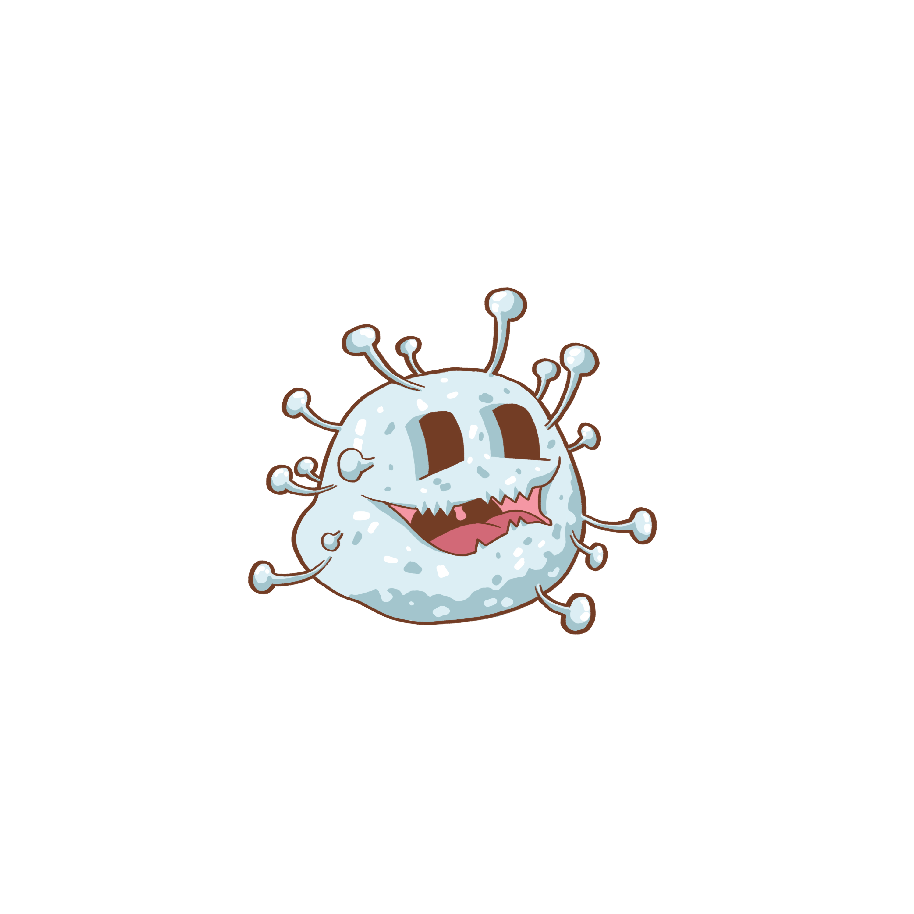

# Native js Seven Day Game Challenge

## Overview

As part of the *General Assembly Software Engineering Immersive* course our challenge was to use native js to write a grid game with DOM manipulation.  Choosing the eighty's pac-man arcade game as a source of inspiration I wrote the game 'Viral Mania!'.

The is game is available to play via the GitHub link [Viral Mania](https://tclark000.github.io/sei-project-1/).

Front End:
- Javascript (ES5) 
- HTML 5 with HTML 5 audio
- CSS

Dev Tools:
- VScode
- Eslint
- Inspector/console logging
- Git
- GitHub

## Plan

I started by planning the [grids](Grids.numbers), one for initial play and the other that was more difficult.  The game was designed and tested with MacOS and Chrome, wide screen.  The more difficult grid is also harder to see and a increased scale would be an improvement here.

The hero character is a caricature of earth with a blinking mask:
<!---
<video style="width:70%" controls>
  <source type="video/mp4" src="heroCharacterMask.mp4">
</video>
-->

Fruit Bowl for points:  

Potion which allows the hero to attack the virus, for a limited time!:  

Hero character, game end:  

Virus Characters:

Virus character when the hero has consumed the potion (also has a yellow glow in the game):

## General Game Antics

The game has a time limit and the hero only 3 lives to play the grid.  If the hero dies they return to the starting point.  There is a pause here where I had planned to add a snippet of music but for now it is just a pause.  The game ends if:
- time runs out
- the hero lives run out
- all the fruit bowls, viruses and potions are consumed! This is a WIN!

When a potion is consumed by the hero the virus image, glow yellow and there is an audio clip change.

The blue virus __may__ not alway kill the hero - asymptomatic of course!

## Lessons Learnt

- Continual testing and console logging!
- Asynchronous coding, using delay with timers
- Emptying a grid by using array.length = 0 to null out
- Using a scroll lock during the game so the arrows do not move the screen
- Using callback for the checkForPotionAndChase function which changes the audio clip:
  - initial 'beep beep' when the game begins
  - potion consumed and the hero is able to kill the viruses
  - the viruses chase the hero
- Methodology in style (element/variables/execution), comments and/or descriptive function and variable names

